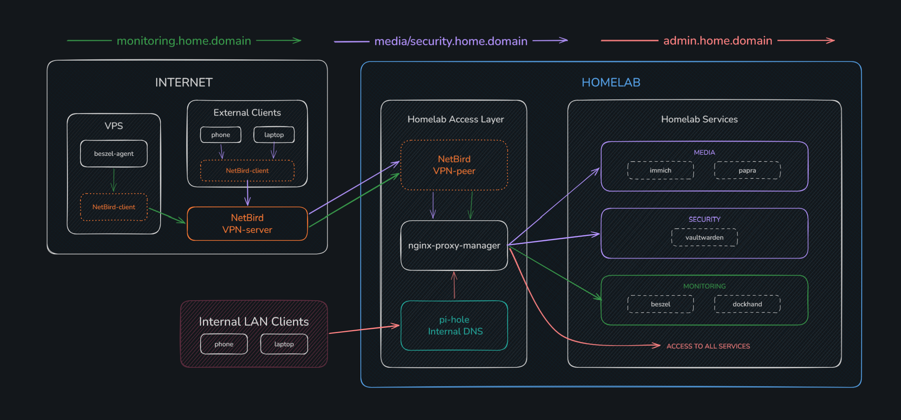

# homelab

Personal homelab on a single server. Everything runs as Docker containers.

## Sections

- [Network Architecture](#network-architecture)
- [Services](#services)
- [Homepage](#homepage)
- [Roadmap](#roadmap)
- [Scripts](#scripts)

## Network Architecture

Two ways to access services:

- **External Internet**: device → NetBird VPN client → NetBird VPN server → home network → NPM (reverse proxy) → services
  - Limited access by rights
- **Local LAN**: device → Pi-hole local DNS → NPM (reverse proxy) → services
  - Full access to all services

## Services

<table>
  <tr>
    <td rowspan="2" width="500px"><b>Infrastructure</b></td>
    <td width="500px">System backups</td>
    <td width="500px">ZeroByte</td>
  </tr>
  <tr>
    <td>Container dashboard</td>
    <td>Dockhand / Portainer</td>
  </tr>
  <tr>
    <td rowspan="2"><b>Media</b></td>
    <td>Document hosting</td>
    <td>Papra</td>
  </tr>
  <tr>
    <td>Photos / Videos</td>
    <td>Immich</td>
  </tr>
  <tr>
    <td rowspan="2"><b>Monitoring</b></td>
    <td>Server metrics</td>
    <td>Beszel</td>
  </tr>
  <tr>
    <td>Uptime monitoring</td>
    <td>Uptime Kuma</td>
  </tr>
  <tr>
    <td rowspan="3"><b>Networking</b></td>
    <td>Local DNS + ad-blocking</td>
    <td>Pi-hole</td>
  </tr>
  <tr>
    <td>Mesh VPN</td>
    <td>Netbird</td>
  </tr>
  <tr>
    <td>Reverse proxy + SSL</td>
    <td>Nginx Proxy Manager</td>
  </tr>
  <tr>
    <td><b>Security</b></td>
    <td>Password vault</td>
    <td>Vaultwarden</td>
  </tr>
  <tr>
    <td rowspan="2"><b>Tool</b></td>
    <td>Homepage</td>
    <td>Glance</td>
  </tr>
  <tr>
    <td>Notifications</td>
    <td>Ntfy</td>
  </tr>
</table>

## Homepage

## Roadmap

#### Service

- [x] Add notification service
- [ ] DDNS setup

#### Infrastructure

- [ ] Try container OS (core-os)
- [ ] Try podman setup instead of docker

#### Automation

- [x] Add run/stop/down scripts
- [x] `config.yaml` for service orchestration (which services to start/stop)
