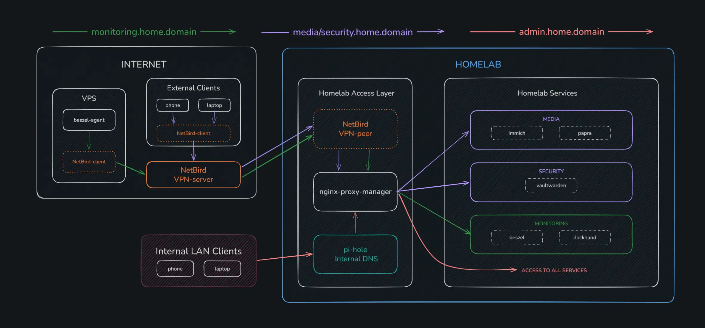
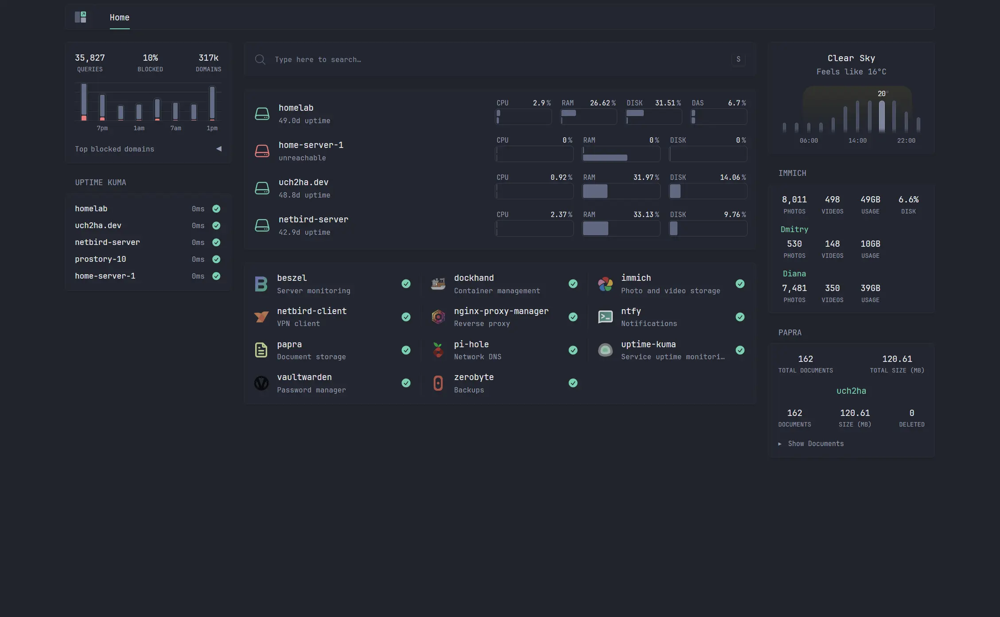

# homelab

Personal homelab on a single node. Everything runs as Docker containers.

## Sections

- [Network Architecture](#network-architecture)
- [Services](#services)
- [Homepage](#homepage)
- [CI](#ci)
- [Scheduler](#scheduler)
- [Note](#note)
- [Roadmap](#roadmap)

## Network Architecture

Two ways to access services:

- **External Internet**: device with NetBird VPN client → NetBird VPN server → home network → NPM (reverse proxy) → services
  - Limited access by rights
- **Local LAN**: device → Pi-hole local DNS → NPM (reverse proxy) → services
  - Full access to all services

## Services

<table>
  <tr>
    <td rowspan="2" width="500px"><b>Infrastructure</b></td>
    <td width="500px">System backups</td>
    <td width="500px">ZeroByte</td>
  </tr>
  <tr>
    <td>Container dashboard</td>
    <td>Dockhand / Portainer</td>
  </tr>
  <tr>
    <td rowspan="2"><b>Media</b></td>
    <td>Document hosting</td>
    <td>Papra</td>
  </tr>
  <tr>
    <td>Photos / Videos</td>
    <td>Immich</td>
  </tr>
  <tr>
    <td rowspan="2"><b>Monitoring</b></td>
    <td>Server metrics</td>
    <td>Beszel</td>
  </tr>
  <tr>
    <td>Uptime monitoring</td>
    <td>Uptime Kuma</td>
  </tr>
  <tr>
    <td rowspan="3"><b>Networking</b></td>
    <td>Local DNS + ad-blocking</td>
    <td>Pi-hole</td>
  </tr>
  <tr>
    <td>Mesh VPN</td>
    <td>Netbird</td>
  </tr>
  <tr>
    <td>Reverse proxy + SSL</td>
    <td>Nginx Proxy Manager</td>
  </tr>
  <tr>
    <td><b>Security</b></td>
    <td>Password vault</td>
    <td>Vaultwarden</td>
  </tr>
  <tr>
    <td rowspan="2"><b>Tool</b></td>
    <td>Homepage</td>
    <td>Glance</td>
  </tr>
  <tr>
    <td>Notifications</td>
    <td>Ntfy</td>
  </tr>
</table>

## Homepage

## CI

Every PR runs automated checks via [GitHub Actions](.github/workflows/pipeline.yaml):

- **Secret scan** — gitleaks detects leaked credentials before merge
- **Linting** — shell (`bash -n` + `shellcheck`), YAML parse, Python (`ruff`)
- **Testing** — integration & unit tests for scripts

See [`test/`](test/README.md) for details on running tests locally.

## Scheduler

Systemd-timer-driven bash scripts for periodic automation. See [`scheduler/`](scheduler/README.md).

<table>
  <tr>
    <td><code>beszel-token-refresh/</code></td>
    <td>Weekly (Mon 02:00)</td>
    <td>Refresh Beszel API token for Glance dashboard</td>
  </tr>
  <tr>
    <td><code>image-update-check/</code></td>
    <td>Daily</td>
    <td>Check for container image updates and notify via ntfy</td>
  </tr>
</table>

## Note

- Designed to be placed at the root of the home directory: `~/homelab`

## Roadmap

#### Service

- [x] Add notification service
- [ ] DDNS setup

#### Infrastructure

- [ ] Try container OS (core-os)
- [ ] Try podman setup instead of docker

#### Automation

- [x] Add run/stop/down scripts
- [x] `config.yaml` for service orchestration (which services to start/stop)
